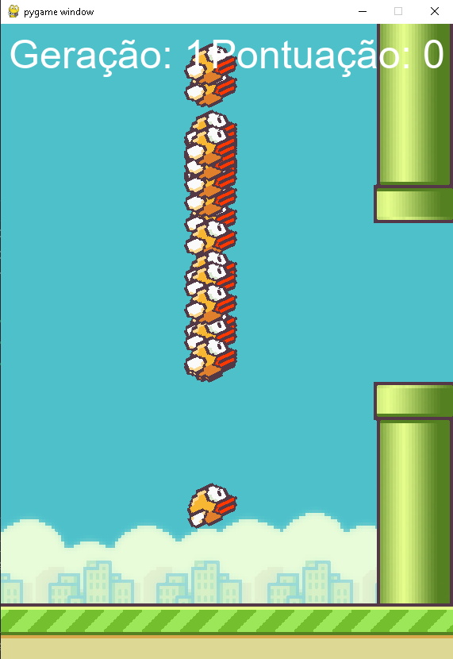

# 🐦 Flappy Bird — IA com NEAT

Implementação do clássico **Flappy Bird** em Python com um agente de inteligência artificial treinado via algoritmo **NEAT** (NeuroEvolution of Augmenting Topologies). O agente aprende a jogar sozinho, evoluindo de geração em geração sem nenhuma intervenção humana.

---

## Demonstração

> O pássaro começa sem saber nada. Em poucas gerações, aprende a desviar dos canos indefinidamente.

---

## Screenshot do game em execução
 

 
---

## Como funciona a IA

O NEAT é um algoritmo evolutivo que cria e otimiza redes neurais. A cada geração:

1. Uma população de pássaros é criada, cada um com sua própria rede neural
2. Cada pássaro recebe como **inputs** da rede:
   - Posição vertical do pássaro (`y`)
   - Distância até o topo do próximo cano
   - Distância até a base do próximo cano
3. Se o **output** da rede for `> 0.5`, o pássaro pula
4. Pássaros que sobrevivem mais tempo e passam mais canos recebem **fitness** maior
5. Os melhores genomas são selecionados para reprodução e mutação

---

## Estrutura do projeto

```
flappy_bird/
│
├── main.py          # Ponto de entrada — inicializa e roda o NEAT
├── jogo.py          # Loop principal do jogo e renderização da tela
├── passaro.py       # Classe Passaro (movimento, animação, máscara)
├── cano.py          # Classe Cano (geração aleatória, colisão)
├── chao.py          # Classe Chao (scroll infinito)
├── constants.py     # Todas as constantes e carregamento de assets
└── config.txt       # Configuração da população e rede neural do NEAT
```

---

## Como executar

### Pré-requisitos

- Python 3.8+
- pip

### Instalação

```bash
# Clone o repositório
git clone https://github.com/seu-usuario/flappy-bird-neat.git
cd flappy-bird-neat

# Instale as dependências
pip install pygame neat-python
```

### Rodando

```bash
python main.py
```

### Modo manual (sem IA)

No arquivo `constants.py`, altere a flag:

```python
AI_JOGANDO = False
```

Pressione `SPACE` para fazer o pássaro pular.

---

## Arquivo do NEAT

O arquivo `config.txt` controla o comportamento evolutivo. 

---

## 📦 Dependências

| Biblioteca | Uso |
|---|---|
| `pygame` | Renderização do jogo e captura de eventos |
| `neat-python` | Algoritmo NEAT para evolução das redes neurais |

---

## 📁 Assets

As imagens devem estar na pasta `imgs/` com os seguintes nomes:

```
imgs/
├── bird1.png
├── bird2.png
├── bird3.png
├── pipe.png
├── base.png
└── bg.png
```

---
